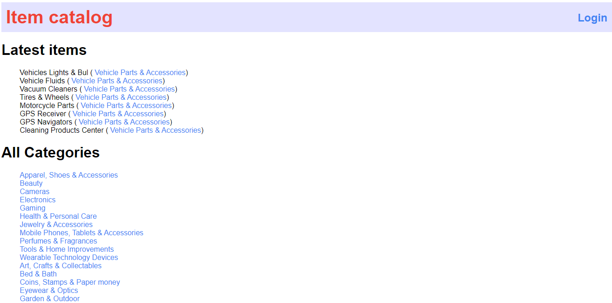
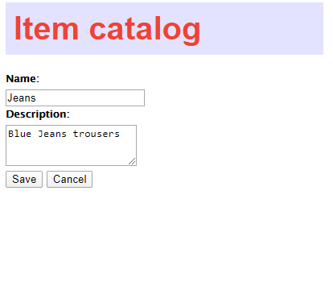

# Item Catalog

## Description
This project is part of [https://www.udacity.com/course/full-stack-web-developer-nanodegree--nd0044](Udacity Full Stack Developer Nanodegree.)
Item Catalog is a web application that provides a list of items within a variety of categories and integrate third party user registration and authentication. Authenticated users have the ability to post, edit, and delete their own items. 

## How to run

- Install [Vagrant](https://www.vagrantup.com/downloads.html)
- Install [VirtualBox](https://www.virtualbox.org/wiki/Downloads)
- Install [Git Bash](https://git-scm.com/downloads) if you're using Windows
- Download Vagrant configuration file from [fullstack-nanodegree-vm repository](https://github.com/udacity/fullstack-nanodegree-vm)
- Inside your VM directory run `vagrant up`
- Use `vagrant ssh` to login to VM 
- Navigate to the project directory
- Run `python database_setup.py` to setup the database_setup
- Run `python populate.py` to populate the database with data
- Run `application.py`
- Visit [localhost:8000](http://localhost:8000) to use the application

## Project overview

### Home page
Visiting `http://localhost:8000` show all categories and latest items

### Edit item
`http://localhost:8000/category/<int:category_id>/items/<int:item_id>/edit`

### Login
`http://localhost:8000/login`

### JSON endpoints

### Show all categories 
`http://localhost:8000/categories/JSON`

### Show items in a category
`http://localhost:8000//category/<int:category_id>/items/JSON`

### Show one item
`http://localhost:8000//category/<int:category_id>/items/<int:item_id>/JSON`

## Licence
This code is licenced under [MIT licence](licence).
